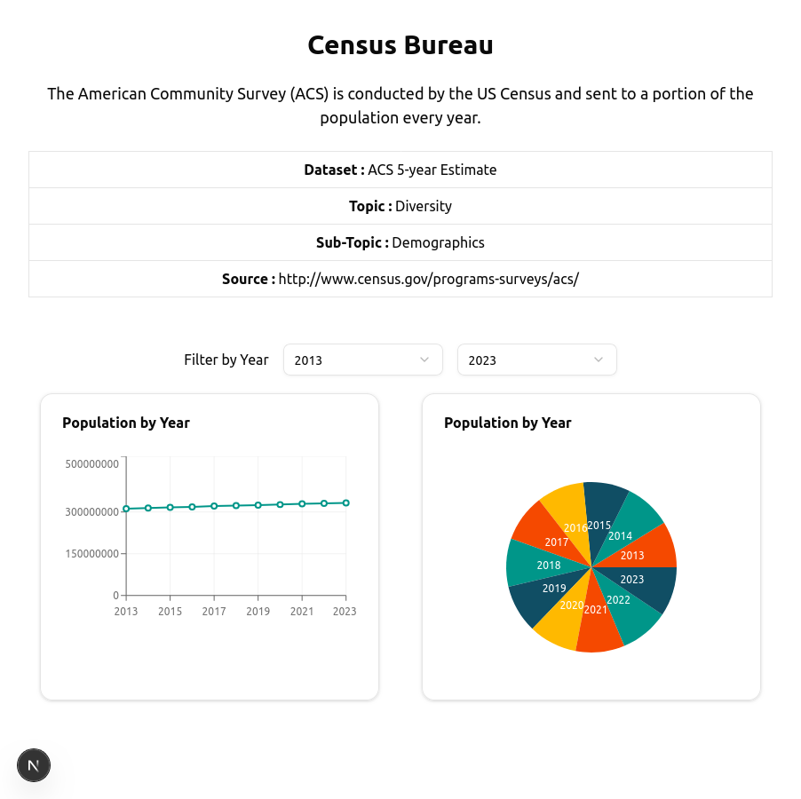

## Getting Started

Installing package

```bash
npm install
```

First, run the development server:

```bash
npm run dev
# or
yarn dev
# or
pnpm dev
# or
bun dev
```

Open [http://localhost:3000](http://localhost:3000) with your browser to see the result.

## Screenshot

### Desktop View


### Tablet View


